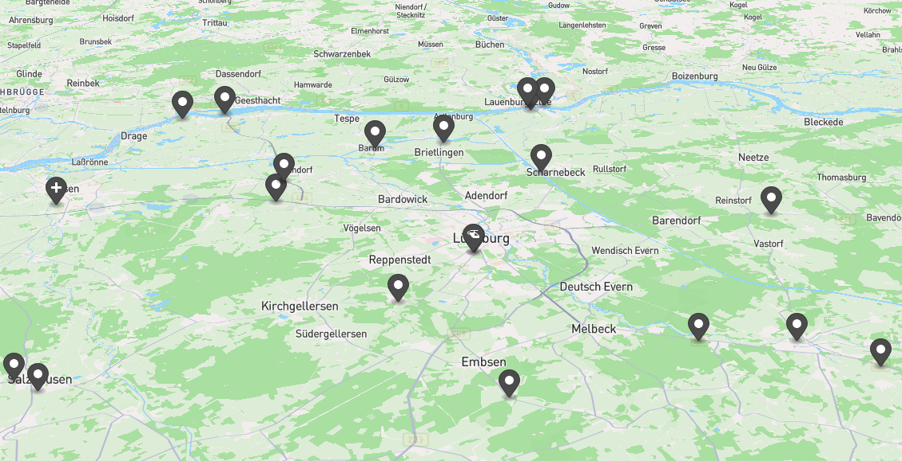

# Aerofly Landegerät: Helicopter Emergency Medical Services

> Create random custom missions for Aerofly FS 4.

This nice little project generates `custom_missions_user.tmc` to use with Aerofly FS 4. The HEMS version of this tool generates random Helicopter Emergency Medical Services (HEMS) missions.

## What does it do?

1. The Landegerät reads a GeoJSON file (see below)
1. …which contains heliports (to start from)
1. …emergency locations (to fly to).
1. …and hospitals (to end your mission).
1. The Landegerät will create multiple missions,
1. …set on different days and at a different time
1. …with randomly selected heliports, emergency sites, and a hospitals.
1. Finally it will fetch METAR weather data for the given location and date,
1. …and export these missions to a `custom_missions_user.tmc` which you then can use in Aerofly FS 4.
1. Optionally the Landegerät creates a Point of Interest (POI) file, which will contain cars and persons for every emergency site. You will need to put this file into your Aerofly FS 4 `scenery/poi` directory (see below).

## How to use it

This tool requires [Node.js](https://nodejs.org/en) (at least version 20) to be installed on your local computer.

The Landegerät is a Command Line Interface (CLI) tool, which means you need to open a terminal to run it. The tool itself does not need to be installed, as the Node.js tool `npx` will take care of downloading as well as executing the Landegerät.

### CLI usage

```
Usage: npx -p @fboes/aerofly-patterns@latest aerofly-hems GEOJSON_FILE [AFS_AIRCRAFT_CODE] [AFS_LIVERY_CODE] [...options]
Create landing pattern lessons for Aerofly FS 4.

Arguments:
  GEOJSON_FILE              GeoJSON file containing possible mission locations.
  AFS_AIRCRAFT_CODE         Internal aircraft code in Aerofly FS 4. Defaults to "ec135".
  AFS_LIVERY_CODE           Internal aircraft code in Aerofly FS 4. Defaults to "adac".

Options:
  --metar-icao=.., -m=..    Use this ICAO station code to find weather reports
                            Example value: EHAM
  --missions=..             Number of missions in file.
                            Default value: 10
  --callsign=..             Optional callsign, else default callsign will be used.
  --no-guides               Try to remove virtual guides from missions.
  --cold-dark               Start cold & dark.
  --transfer, -t            Mission types can also be transfers.
  --poi, -p                 Generate POI files in sub directory.
  --directory, -d           Create files in a subdirectory instead of current directory.
  --help, -h                Will output the help.
```

Example:

```bash
npx -p @fboes/aerofly-patterns@latest aerofly-hems C:\User\example\Downloads\hamptons.geojson ec135 --metar-icao=KISP --callsign=MEDEVAC11
```

As of present there are three helicopters in Aerofly FS 4:

| `AEROFLY_AIRCRAFT_CODE` | Type                      |
| ----------------------- | ------------------------- |
| `ec135`                 | Eurocopter EC135          |
| `uh60`                  | Sikorsky UH-60 Black Hawk |
| `r22`                   | Robinson R22              |

## Download the missions

There are already multiple mission files generated in [`/data`](./data/). They are stored in directories with the pattern `data/HEMS-[LOCATION_NAME]-[AEROFLY_AIRCRAFT_CODE]/`. These files are in each directory:

- `custom_missions_user.tmc`: Mission file with multiple emissions
- Optional a directory with the POI files (see below)

See [the installation instructions](https://fboes.github.io/aerofly-missions/docs/generic-installation.html) on how to import the missions into Aerofly FS 4.

### Using the POI file

If you want to the "Landegerät: HEMS" can generate POI files for you. These file contain positions for cars, persons and other objects to be present at every emergency site.

You will need to copy the generated POI folder to your Aerofly FS 4 user directory, and there to `scenery/poi`.

> Idea donated by [ApfelFlieger](https://www.aerofly.com/community/forum/index.php?thread/23415-searching-for-simple-method-to-add-stock-objects-to-scenery/&postID=150121#post150121).

## Creating and editing the GeoJSON file

The mission generator needs a [GeoJSON file](https://geojson.org/) which contains all possible locations to be used in the missions.

This project contains example GeoJSON files, which will help you build your own missions source file.

1. [Lüneburg](../dist/data/hems/lueneburg.geojson) (open in [geojson.io](https://geojson.io/#data=data:text/x-url,https%3A%2F%2Fraw.githubusercontent.com%2Ffboes%2Faerofly-patterns%2Frefs%2Fheads%2Fdevelop%2Fdist%2Fdata%2Fhems%2Flueneburg.geojson))
2. [San Francisco](../dist/data/hems/san_francisco.geojson) (open in [geojson.io](https://geojson.io/#data=data:text/x-url,https%3A%2F%2Fraw.githubusercontent.com%2Ffboes%2Faerofly-patterns%2Frefs%2Fheads%2Fdevelop%2Fdist%2Fdata%2Fhems%2Fsan_francisco.geojson))

### Content of the GeoJSON file

At the base of this file it needs a `FeatureCollection`, in which a list of `Feature` locations need to be put. There are three types of `Feature` locations:

- **Heliports** as a possible starting point for your helicopter; at least one is required.
- **Hospitals** as a possible end point to return at the end of your mission. If no hospital is given, the heliport will be used as hospital instead.
- All other locations are considered to be **emergency sites**.



> [geojson.io](https://geojson.io/) is a free online editor for creating and modifying GeoJSON files. It allows for adding, editing and deleting GeoJson `Feature` locations on an interactive map, as well as editing the properties of each `Feature`. It also will display icons matching the [`marker-symbol`](https://labs.mapbox.com/maki-icons/).

To create the different types of locations, you will need to add properties to every GeoJSON `Feature`. Find the list of properties below:

### Properties of heliports

| Property                   | Type     | Description                        |
| -------------------------- | -------- | ---------------------------------- |
| `properties.marker-symbol` | `string` | `heliport`                         |
| `properties.title`         | `string` | Name of location                   |
| `properties.icaoCode`      | `string` | ICAO code                          |
| `properties.direction`     | `number` | Optional orientation of helicopter |

### Properties of hospitals

| Property                   | Type     | Description                 |
| -------------------------- | -------- | --------------------------- |
| `properties.marker-symbol` | `string` | `hospital` or `hospital-JP` |
| `properties.title`         | `string` | Name of location            |
| `properties.icaoCode`      | `string` | ICAO code                   |

### Properties of emergency sites

| Property                   | Type     | Description                     |
| -------------------------- | -------- | ------------------------------- |
| `properties.marker-symbol` | `string` | see below, or can be left empty |
| `properties.title`         | `string` | Name of location                |
| `properties.direction`     | `number` | Optional orientation of POI     |

There are special `properties.marker-symbol` values for emergency sites, which will create different types of emergency sites:

| `properties.marker-symbol` | Missions                                                          |
| -------------------------- | ----------------------------------------------------------------- |
| default                    | Patient recovery                                                  |
| `car`, `road-accident`     | Car accident                                                      |
| `person`¹, `cricket`       | Lost person                                                       |
| `ship`¹, `ferry`           | Ship SAR                                                          |
| `bicycle`                  | Bicycle accident (not yet fully implemented)                      |
| `bus`                      | Bus accident (not yet fully implemented)                          |
| `farm`                     | Farming accident (not yet fully implemented)                      |
| `fire-station`             | Fire (not yet fully implemented)                                  |
| `logging`                  | Logging accident (not yet fully implemented)                      |
| `mountain`                 | Lost person in mountain area accident (not yet fully implemented) |
| `rail-light`               | Tram accident (not yet fully implemented)                         |
| `rail-metro`               | Metro train accident (not yet fully implemented)                  |
| `rail`                     | Train accident (not yet fully implemented)                        |
| `swimming`                 | Lost person in open water (not yet fully implemented)             |

¹) Some marker symbols will not spawn the correct icon in [geojson.io](https://geojson.io/), but are still valid mission types.

---

For more information see the [main documentation](../README.md).
